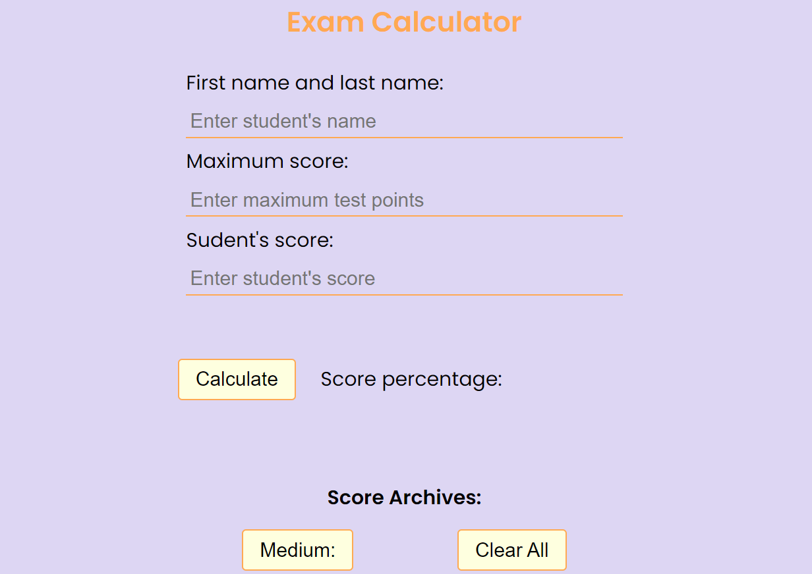

<h1 align="center">Exam Calculator</h1>
<p>
  
</p>

> This app is helpfull tool for teacher which must calculate score of exam or test in comfortable and fast way.

### About The Project


Link to project: https://examcalculator.netlify.app/

## Repository

```sh
https://github.com/jesiennart/Roll100d.git
```
## Technologies Used


## Features

<ul>
<li>Count score in percentage from diffrent test max points.</Li>
<li>Every count score is adding to students score archives.</Li>
<li>List of students result.</Li>
<li>In the archives every student's score test is adding to whole class result with medium score in percentege of whole group.</Li>
</ul>

## Screenshots



## Project Status

In progress.

## Room for Improvement

<ul>
<li>I will try to improve app by adding possibility to delete one line in archives chooses by user with recalculate medium score.</Li>
</ul>

## Acknowledgements

This project was inspired by my wife (teacher) and hers teachers friends. They have problem to calculate percentage score test from different max points score to earn. In this app without calculator and notes they could automatic calculate every result with list of students result.

## Author

👤 **Artur Molenda**

* Github: [@jesiennart](https://github.com/jesiennart)

## Contact

Email: artmol@op.pl